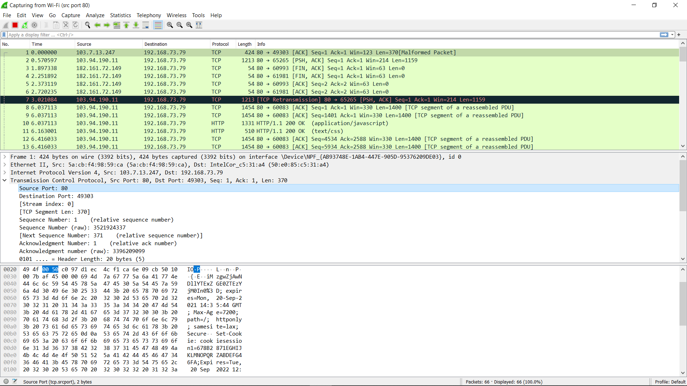
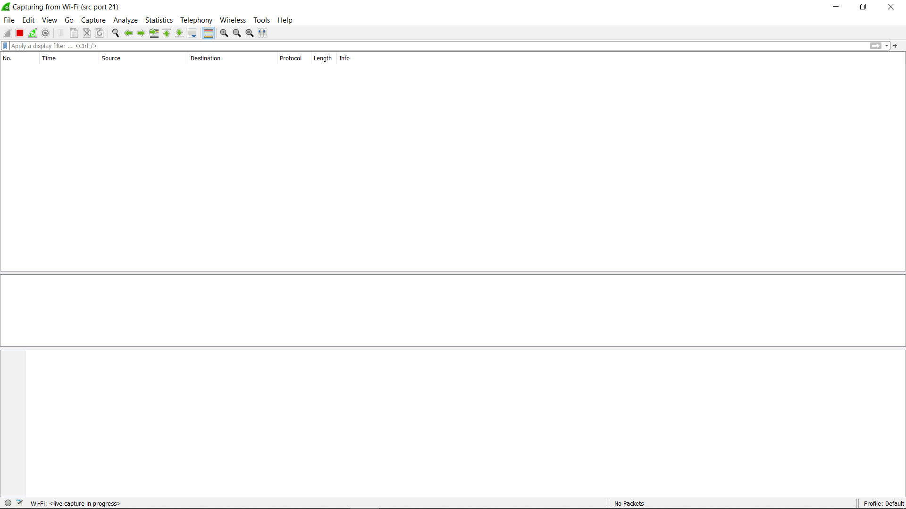
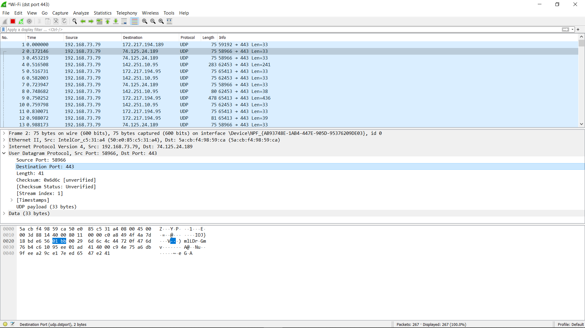
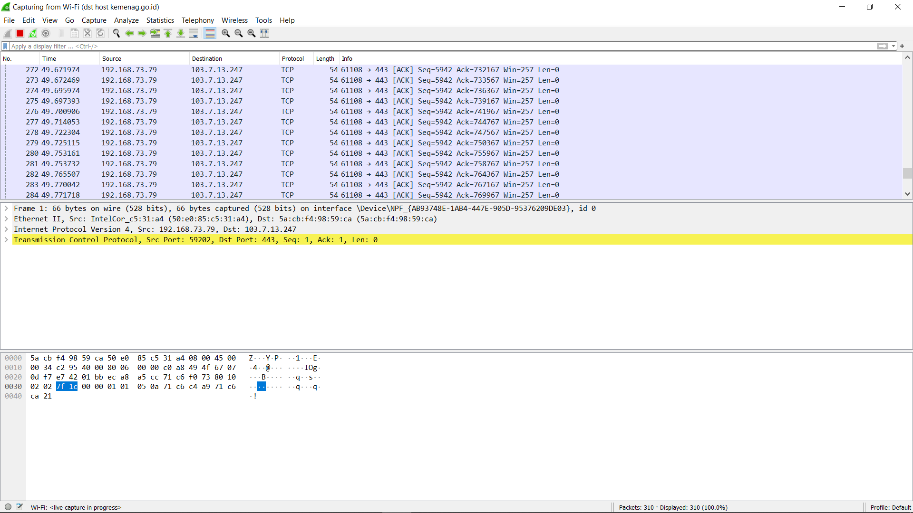
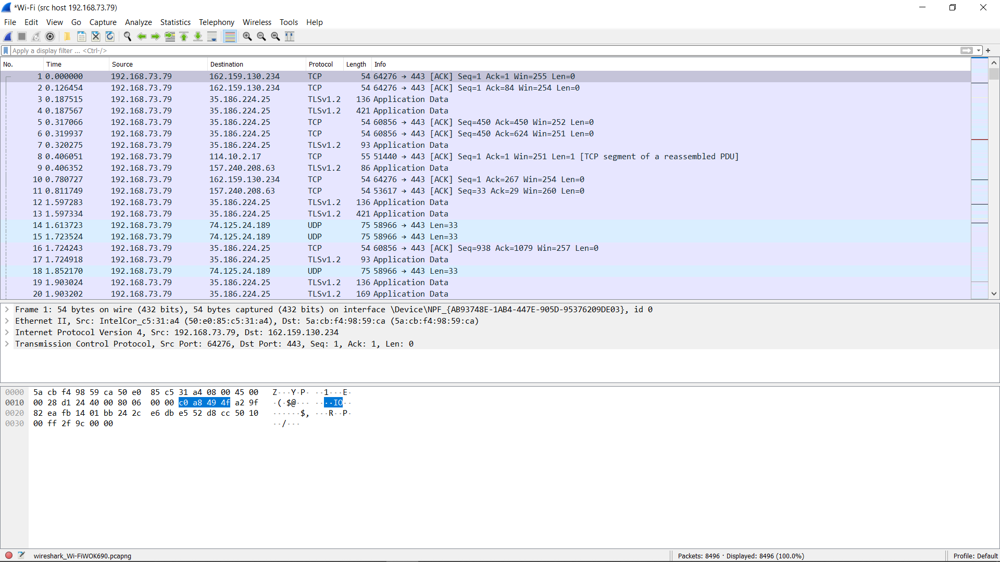

# Jarkom-Modul-1-B08-2021

## Pembahasan Praktikum Modul-1
1. Sebutkan webserver yang digunakan pada "ichimarumaru.tech"!  
2. Temukan paket dari web-web yang menggunakan basic authentication method! 
3. Ikuti perintah di basic.ichimarumaru.tech! Username dan password bisa didapatkan dari file .pcapng! 
4. Temukan paket mysql yang mengandung perintah query select! 
5. Login ke portal.ichimarumaru.tech kemudian ikuti perintahnya! Username dan password bisa didapat dari query insert pada table users dari file .pcap! 
6. Cari username dan password ketika melakukan login ke FTP Server! 
7. Ada 500 file zip yang disimpan ke FTP Server dengan nama 0.zip, 1.zip, 2.zip, ..., 499.zip. Simpan dan Buka file pdf tersebut. (Hint = nama pdf-nya "Real.pdf") 
8. Cari paket yang menunjukan pengambilan file dari FTP tersebut! 
9. Dari paket-paket yang menuju FTP terdapat inidkasi penyimpanan beberapa file. Salah satunya adalah sebuah file berisi data rahasia dengan nama "secret.zip". Simpan dan buka file tersebut! 
10. Selain itu terdapat "history.txt" yang kemungkinan berisi history bash server tersebut! Gunakan isi dari "history.txt" untuk menemukan password untuk membuka file rahasia yang ada di "secret.zip"! 
11. Filter sehingga wireshark hanya mengambil paket yang berasal dari port 80!  
12. Filter sehingga wireshark hanya mengambil paket yang mengandung port 21! 
13. Filter sehingga wireshark hanya menampilkan paket yang menuju port 443! 
14. Filter sehingga wireshark hanya mengambil paket yang tujuannya ke kemenag.go.id! 
15. Filter sehingga wireshark hanya mengambil paket yang berasal dari ip kalian! 

## Jawaban
### No 1 : Mencari webserver pada link `ichimarumaru.tech`
Step :
1. Membuka .pcap file
2. Mengetikkan Filter `tcp.stream eq12`
3. Pada Packet HTML Klik Kanan Kemudian Follow -> TCP Stream
4. Dapat Melihat Webserver Pada Rincian

Webserver yang digunakan pada `ichimarumaru.tech` adalah NGINX. Hasil :

### No 2
Step : Mencari basic authentication pada packet
1. Mengetik `http.authbasic` pada filter
Hasil :

### No 3 : Melaksanakan perintah pada website dengan melakukan login dengan username dan password yang sudah ditentukan.
Step :
1. Mencari username dan password dengan membuka .pcap file.
2. Username dan password ditemukan dengan mengetik filter `http.host == 'basic.ichimarumaru.tech'`
3. Mengerjakan soal sesuai perintah.

Hasil :

### No 4 : Menemukan paket mySQL yang berisi query SELECT
Step :
1. Membuka .pcap file
2. Mengetikkan filter `mysql.query`
3. Memilih satu-satu packet dan melihat detail 'MySQL Protocol' paketnya
4. Menemukan paket yang memiliki keterangan SELECT

Hasil :
#### SELECT DATABASE;

#### SELECT USERNAME FROM USERS;

#### SELECT COUNT( * ) FROM USERS;

### No 5 : Mengikuti perintah pada website `portal.ichimarumaru.tech` dengan melakukan login dengan username dan password yang sudah ditetapkan.
Step :
1. Membuka .pcap file
2. Mengetikkan filter `mysql.query`
3. Memilih satu-satu packet dan melihat detail 'MySQL Protocol' paketnya
4. Menemukan paket yang memiliki keterangan INSERT
5. Menemukan username dan password pada keterangan query

Hasil :

### No 6 : Cari username dan password ketika login ke FTP Server
Step : 
1. Membuka .pcap file
2. Mengetikkan filter `ftp.request.command == USER || ftp.request.command == PASS`

Hasil :

### No 7 : Ada 500 file zip yang disimpan ke FTP Server dengan nama 0.zip, 1.zip, 2.zip, ..., 499.zip. Simpan dan Buka file pdf tersebut. (Hint = nama pdf-nya "Real.pdf")
Step :
1. Membuka .pcap file
2. Mengetikkan filter `ftp.data.contains 'Real.pdf'`
3. Klik Kanan -> Follow -> TCP Stream
4. Show raw data -> Save as..

Hasil :

### No 8 : Cari paket yang menunjukan pengambilan file dari FTP tersebut
Step : 
1. Membuka .pcap file.
2. Mengetikkan filter `ftp.request.command == RETR`

Hasil :

### No 9 : Dari paket-paket yang menuju FTP terdapat inidkasi penyimpanan beberapa file. Salah satunya adalah sebuah file berisi data rahasia dengan nama "secret.zip". Simpan dan buka file tersebut
Step :
1. Membuka .pcap file
2. Mengetikkan filter `ftp-data`
3. Pada paket secret.zip klik kanan -> follow -> TCP Stream
4. Save as Raw

Hasil :

### No 10 : Selain itu terdapat "history.txt" yang kemungkinan berisi history bash server tersebut! Gunakan isi dari "history.txt" untuk menemukan password untuk membuka file rahasia yang ada di "secret.zip"
Step :
1. Buka .pcap file
2. Karena data yang dicari mengandung secret.zip maka mengetikkan filter `ftp-data contains secret.zip`
3. Command bash yang ditemukan dari packet secret.zip ditemukan pada file bukanapaapa.txt
4. Masukka filter baru `ftp-data`
5. Cari packet yang memuat 'bukanapaapa.txt'
6. Setelah menemukan buka line-based text data pada informasi paket dan cari passwordnya
7. Password ditemukan yaitu; d1b1langbukanapaapajugagapercaya

Hasil :

### No 11 : Filter sehingga wireshark hanya mengambil paket yang berasal dari port 80!
Step : Mencari basic authentication pada packet
1. Mengetik `src port 80` pada filter

### No 12 : Filter sehingga wireshark hanya mengambil paket yang mengandung port 21!
Step : Mencari basic authentication pada packet
1. Mengetik `src port 21` pada filter

### No 13 : Filter sehingga wireshark hanya menampilkan paket yang menuju port 443!
Step : Mencari basic authentication pada packet
1. Mengetik `dst port 443` pada filter

### No 14 : Filter sehingga wireshark hanya mengambil paket yang tujuannya ke kemenag.go.id!
Step :
1. Mengetik `dst host kemenag.go.id` pada filter
 

### No 15 : Filter sehingga wireshark hanya mengambil paket yang berasal dari ip kalian!
Step :
1. IP dapat dilihat terlebih dahulu di command prompt menggunakan ipconfig
2. Mengetik `src host 192.168.73.79`

### Kendala
- Mungkin kendala pada wifi

